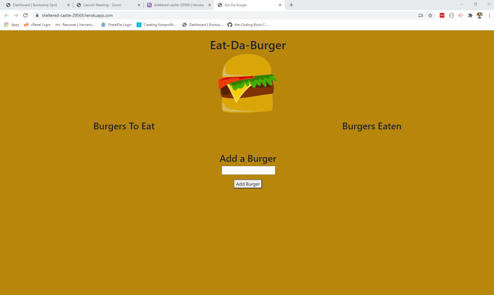

# Eat-Da-Burger 

## Deployed Application and Link to Portfolio

Application: <https://sheltered-castle-29569.herokuapp.com>

Portfolio: <https://jth2698.github.io/portfolio/>

## Screenshot

## Description

A simple web application that allows users to add burgers that the user wants to eat, mark those burgers as eaten, and to delete those burgers from the page. The application is structured using the "MVC" structure as follows - 

* App dependencies are express, express-handlebars, and mysql
* The main app directory includes the following subdirectories: config, controllers, db, models, public, and views and includes a `server.js` as the entry point
* Server routing is handled by  `burgerController.js` in the controllers subdirectory
* The core assets for the application including css, images, and client-side JavaScript are located in ./public/assets
* The site is dynamic and is built using express-handlebars and mysql. The handlebars `index.handlebars` and layouts / partials are included in the views subdirectory
* Content is built using a mysql database. The database schema and seeds are included in the db subdirectory
* The database connection and configuration are handled by `connection.js` and `orm.js` in the config subdirectory
* Finally, database queries are handled using `burger.js` in the models subdirectory

## Table of Contents
* [Installation](#installation)
* [Usage](#usage)
* [Contribution Guidelines](#contribution)
* [Testing](#testing) 
* [License](#license)
* [Questions](#questions)
  
## Installation

No installation is needed to use the application. The application is deployed via Heroku at <https://sheltered-castle-29569.herokuapp.com>

## Usage

* Add a burger using the form at the bottom of a page
* On submission, burger is added to the "Burgers to Eat" column
* Once "munch" is clicked, burger moves to the Burgers Eaten column.
* Burgers can be deleted from either column

## Contribution Guidelines

All contributions welcome.

## Testing

No testing included.

## License

MIT

## Questions

* <https://github.com/jth2698>
* <jth2698@gmail.com>